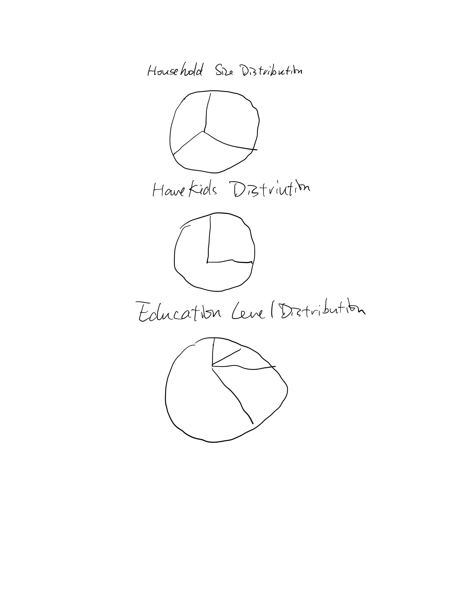
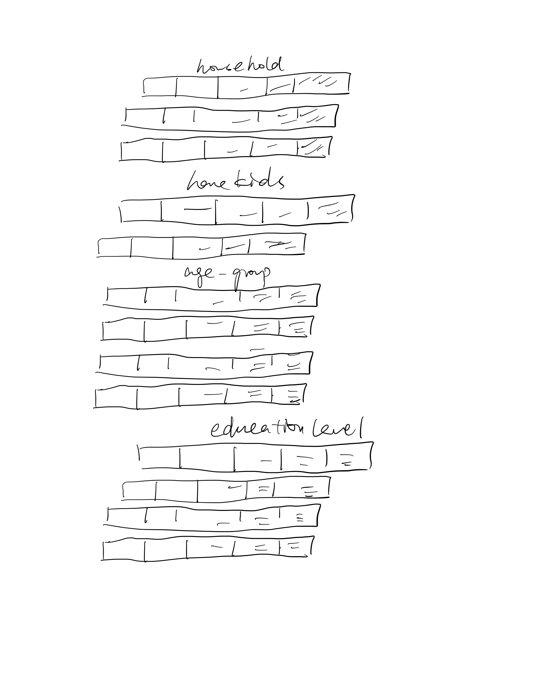

```{r setup, include=FALSE}
knitr::opts_chunk$set(echo = TRUE,
                      eval= TRUE,
                      warning=FALSE,
                      message=FALSE)
```
# 1. Overview

In this take home exercise, I will reveal the demographic of the city of Engagement, Ohio USA by using a patchwork of pie charts to visualize the distribution of participants and a Diverging stacked bar chart to visualize the joviality across different groups of participants.

# 2. Getting Started

Before we get started, it is important to ensure that the R packages have been installed.  If yes, we will load the R packages. If they have yet to be installed, we will install the R packages and load them onto R environment.

The chunk code below will do the trick.

```{r}
packages = c('tidyverse',"HH","vcd",'knitr','ggdist', 'ggridges',
             'patchwork', 'ggthemes', 'hrbrthemes',
             'ggrepel', 'ggforce')

for(p in packages){
  if(!require(p, character.only = T)){
    install.packages(p)
  }
  library(p, character.only = T)
}

```

# 3. Importing Data

The code chunk below import "Participants.csv" from the data folder into R by using [`read_csv()`](https://readr.tidyverse.org/reference/read_delim.html) of [**readr**](https://readr.tidyverse.org/index.html) and save it as an tibble data frame called "participant_data".

```{r echo=TRUE}
participant_data <- read_csv("data/Participants.csv")
```


# 4. Data Wrangling

We group the age data into 4 groups including "18-28", "29-38", "39-49" and "50-60". Also, we group joviality data into 4 groups "0.2-0.4", "0.4-0.6", "0.6-0.8" and "0.8-1.0".

```{r echo=TRUE}
participant_data["age_group"] = cut(participant_data$age, c(18,29,39,50,60),
                                    c("18-28","29-38","39-49","50-60"), include.lowest=TRUE)
participant_data["joviality_group"] = cut(participant_data$joviality, c(0,0.2,0.4,0.6,0.8,1), 
                                          c("0-0.2", "0.2-0.4","0.4-0.6","0.6-0.8","0.8-1.0"), include.lowest=TRUE)
participant_data
```

We calculate the number of population in different degree of joviality by different groups including householdSize, haveKids, age_group, educationLevel, and interestGroup.

```{r echo=TRUE}
t1=table(participant_data$householdSize,participant_data$joviality_group)
t2=table(participant_data$haveKids,participant_data$joviality_group)
t3=table(participant_data$age_group,participant_data$joviality_group)
t4=table(participant_data$educationLevel,participant_data$joviality_group)
t5=table(participant_data$interestGroup,participant_data$joviality_group)

participant=as.data.frame(rbind(t1,t2,t3,t4,t5))
participant <- cbind(Type = rownames(participant), participant)
rownames(participant) <- 1:nrow(participant)

participant["Subtable"] <- c("householdSize","householdSize","householdSize",
                          "haveKids","haveKids",
                          "age_group","age_group","age_group","age_group",
                        "educationLevel","educationLevel","educationLevel","educationLevel",
                        "interestGroup","interestGroup","interestGroup","interestGroup","interestGroup",
                      "interestGroup","interestGroup","interestGroup","interestGroup","interestGroup")

participant=participant %>%
  bind_rows(summarise_all(., ~if(is.numeric(.)) sum(.) else "Total"))
```

The below participant table shows the distribution of participants of different groups.

```{r}
kable(participant)
```

The below codes prepare the number of particpants of different groups for further visualization

```{r}
t6=table(participant_data$householdSize)
t7=table(participant_data$haveKids)
t9=table(participant_data$educationLevel)
t10=table(participant_data$interestGroup)

t6=as.data.frame(t6)
t7=as.data.frame(t7)
t9=as.data.frame(t9)
```

# 5. A Patchwork of 3 Pie Charts

We would like to see the education level distribution, household size distribution and havekids distribution of the participants.

# 5.1 Sketch of Proposed Design



We would like to see the education level distribution, household size distribution and havekids distribution of the participants using pie charts  of ggplot(), gem_bar() and coord_polar().

# 5.2 A Pie Chart of Household Size Distribution Among Participants

The household size distribution is plotted as below.

```{r}
ggplot(t6,aes(x="", y=Freq, fill=Var1))+
  geom_bar(width = 1, stat = "identity")+
  coord_polar("y", start=0)

```

We use scale_fill_brewer() to change the color, ggtitle() to add the title, theme_ipsum() to change the features of the plot and amend the labs.

```{r}
pie1=ggplot(t6,aes(x="", y=Freq, fill=Var1))+
  geom_bar(width = 1, stat = "identity")+
  coord_polar("y", start=0)+
  scale_fill_brewer(palette="Spectral")+
  ggtitle("Household Size Distribution")+
  labs(fill='Household Size')+
  xlab("") + 
  ylab("Participants")+
  theme_ipsum()

pie1
```

Similarly, we have the distribution of havekids and education level.

# 5.3 A Pie Chart of HaveKids Distribution Among Participants

```{r}
pie2=ggplot(t7,aes(x="", y=Freq, fill=Var1))+
  geom_bar(width = 1, stat = "identity")+
  coord_polar("y", start=0)+
  scale_fill_brewer(palette="Spectral")+
  ggtitle("HaveKids Distribution")+
  labs(fill='HaveKids')+
  xlab("") + 
  ylab("Participants")+
  theme_ipsum()

pie2
```

# 5.4 A Pie Chart of Education Level Distribution Among Participants

```{r}
pie3=ggplot(t9,aes(x="", y=Freq, fill=Var1))+
  geom_bar(width = 1, stat = "identity")+
  coord_polar("y", start=0)+
  scale_fill_brewer(palette="Spectral")+
  scale_fill_brewer(palette="Spectral")+
  ggtitle("Education Level Distribution")+
  labs(fill='Education Level')+
  xlab("") + 
  ylab("Participants")+
  theme_ipsum()

pie3
```

# 5.5 Patchwork of 3 pie charts

We use patchwork to combine the three pie charts. The patch work finally gives a overview of distribution of paricipants in terms of education level, household size and have kids or not.

```{r fig.align="center",fig.width=12,fig.height= 12, size=12}
patchwork <- (pie1 /pie2  /pie3)
patchwork
```

# 6. A Diverging Stacked Bar Chart

# 6.1 Sketch of Proposed Design


We will use diverging stacked bar chart to show the joviality level of different groups of participants.

# 6.2 Plot the Diverging Stacked Bar Chart Using likert

The code chunk below plot the diverging stacked bar chart by using **likert**  to show the joviality level of different groups of participants.

```{r fig.align="center",fig.width= 11,fig.height= 11}
likert(Type ~ . | Subtable, data = participant, as.percent = TRUE, layout = c(1, 6))
```

The plot above is unreadable, we want to scale the plot to visualize better by add scale feature to likert.

```{r fig.align="center",fig.width= 11,fig.height= 11}
likert(Type ~ . | Subtable, data = participant, as.percent = TRUE,
       scales = list(y = list(relation = "free")), layout = c(1, 6))
```

We want to sort the bars to make it easier to interpret so we add the order.

```{r fig.align="center",fig.width= 11,fig.height= 11}
dsbc=likert(Type ~ . | Subtable, data = participant, as.percent = TRUE, positive.order = TRUE, 
       scales = list(y = list(relation = "free")), layout = c(1, 6))
dsbc
```

# 7. Final Visualization and Findings

```{r fig.align="center",fig.width= 11,fig.height= 11}
patchwork
```
From the pie charts, we can find that around only 30% of participants have kids. The education level of more than half of the participants is highschool or college or below.

```{r fig.align="center",fig.width= 11,fig.height= 11}
dsbc
```
The diverging stacked bar chart shows that participants with only one household size may have lower joviality than those with 2 or 3. Participants with kids also have a higher level of joviality. Young people are more likely to be jovial than the older. Also, higher education level may come with higher level of joviality. Participants with Interest Group of C,E and G have higher level of joviality than those with Interest Group H.


